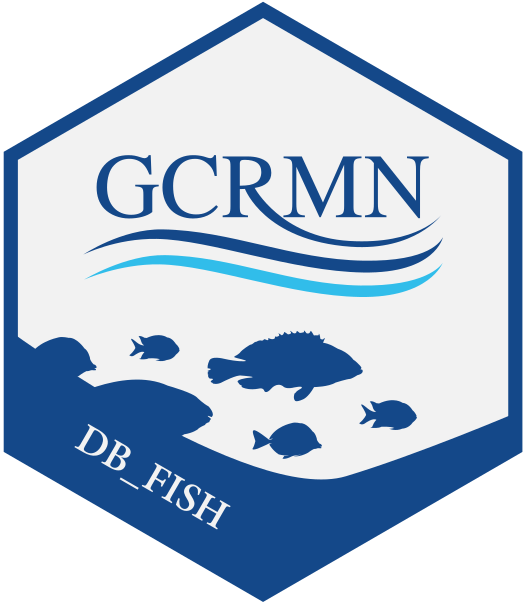

# gcrmndb_fish 

## 1. Introduction

Coral reef benthic monitoring have started in different places of the world based on different methods.

`gcrmndb_fish` is one of the synthetic dataset (the other is `gcrmndb_benthos`) created and maintained by the GCRMN.

## 2. How to contribute?

## 3. Description of variables

## 4. Quality checks

## 5. List of individual datasets

